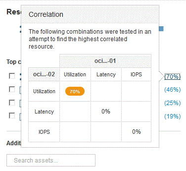

= Analyse des ressources corrélées
:allow-uri-read: 
:icons: font
:imagesdir: ../media/

[role="lead"]
Lorsque vous recherchez des problèmes de performances et que vous ouvrez la _page d'inventaire_ pour un périphérique, vous devez utiliser la liste des ressources corrélées principales pour affiner les données affichées dans les graphiques de performances. Une ressource avec un pourcentage élevé indique que la ressource a une activité similaire à celle de la ressource de base.

== Description de la tâche

Vous êtes en train d'étudier un problème de performances et d'ouvrir la page de ressources d'un périphérique.

== Étapes

. Dans la liste *meilleures ressources corrélées*, la première ressource est la ressource de base. Les ressources corrélées de la liste sont classées par pourcentage d'activité corrélée au premier périphérique. Cliquez sur le pourcentage lié de corrélation pour afficher les détails. Dans cet exemple, la corrélation de 70 % est en utilisation, de sorte que la ressource de base et cette ressource corrélée ont une utilisation également élevée.
+

. Pour ajouter une ressource corrélée aux graphiques de performances, cochez la case dans la liste *Ressources corrélées supérieures* de la ressource que vous souhaitez ajouter. Par défaut, chaque ressource fournit le total des données disponibles, mais vous pouvez sélectionner lecture seule ou écriture seule des données dans le menu de la case à cocher.
+
Chaque ressource des graphiques a une couleur différente pour vous permettre de comparer les mesures de performances de chaque ressource. Seul le type de données approprié est tracé pour les mesures de mesure sélectionnées. Par exemple, les données de l'UC n'incluent pas les mesures de lecture ou d'écriture. Seules les données totales sont donc disponibles.

. Cliquez sur le nom lié de la ressource corrélée pour afficher sa page d'inventaire.
. Si vous ne voyez pas de ressource répertoriée dans les ressources les plus corrélées qui, selon vous, devraient être prises en compte dans l'analyse, vous pouvez utiliser la case *Rechercher des actifs* pour trouver cette ressource.

