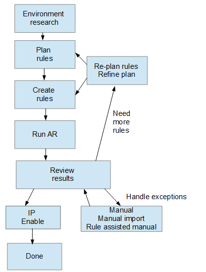

= Avant de commencer
:allow-uri-read: 
:icons: font
:imagesdir: ../media/

[role="lead"]
Vous devez savoir comment votre environnement est configuré avant de définir les règles d'identification des périphériques. Plus vous en saurez sur votre environnement, plus il sera facile d'identifier les périphériques.

Vous devez répondre à des questions similaires aux suivantes pour vous aider à créer des règles précises :

* Votre environnement respecte-t-il des normes de dénomination pour les zones ou les hôtes, et quel est le pourcentage exact de ces zones ?
* Votre environnement utilise-t-il un alias de commutateur ou un alias de stockage et correspond-il au nom d'hôte ?
* Votre environnement utilise-t-il un outil SRM et pouvez-vous l'utiliser pour identifier les noms d'hôte ? Quelle est la couverture offerte par le SRM ?
* À quelle fréquence les schémas de nommage évoluent-ils dans votre environnement ?
* Y a-t-il eu des acquisitions ou des fusions qui ont introduit différents systèmes de dénomination ?

Après l'analyse de votre environnement, vous devriez être en mesure d'identifier les normes de dénomination existantes que vous pouvez vous attendre à des rencontres de fiabilité. Les informations que vous avez rassemblées peuvent être représentées graphiquement dans un chiffre similaire à ce qui suit :

image::../media/ar-workflow-circles.gif[cercles de flux de travail ar]

Dans cet exemple, le plus grand nombre de périphériques sont représentés de manière fiable par des alias de stockage. Les règles permettant d'identifier les hôtes utilisant des alias de stockage doivent d'abord être écrites, les règles utilisant des alias de commutateur doivent être écrites ensuite et les dernières règles créées doivent utiliser des alias de zone. En raison du chevauchement de l'utilisation des alias de zone et des alias de commutateur, certaines règles d'alias de stockage peuvent identifier des périphériques supplémentaires, laissant moins de règles requises pour les alias de zone et les alias de commutateur.

== Étapes de définition des périphériques dans votre environnement

En général, vous utiliseriez un flux de travail similaire à celui ci-dessous pour identifier les périphériques de votre environnement. L'identification est un processus itératif qui peut nécessiter plusieurs étapes de planification et de raffinage des règles.

[NOTE]
====
Si votre environnement comporte des périphériques non identifiés (appelés « périphériques inconnus » ou génériques) et que vous configurez par la suite une source de données qui identifie ces périphériques lors de l'interrogation, ils ne seront plus affichés ni comptabilisés en tant que périphériques génériques.

====