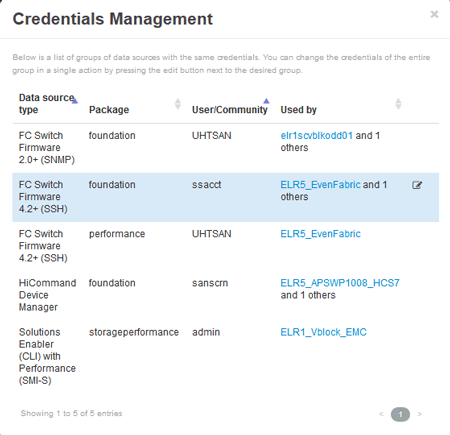

= Modification des informations d'identification de la source de données
:allow-uri-read: 
:icons: font
:imagesdir: ../media/

[role="lead"]
Si plusieurs sources de données du même type partagent un nom d'utilisateur et un mot de passe, vous pouvez modifier le mot de passe de tous les périphériques du groupe en même temps.

== Étapes

. Dans la barre d'outils Insight, cliquez sur *Admin*.
+
La liste *sources de données* s'ouvre.

. Cliquez sur le bouton *actions* et sélectionnez l'option *Modifier les informations d'identification*.
. Dans la boîte de dialogue gestion des informations d'identification, sélectionnez l'un des groupes de sources de données dans la liste.
+
L'icône Modifier, un stylo sur une feuille de papier, devient active à droite.

+

. Cliquez sur *Modifier*.
. Entrez le nouveau mot de passe et confirmez-le.

