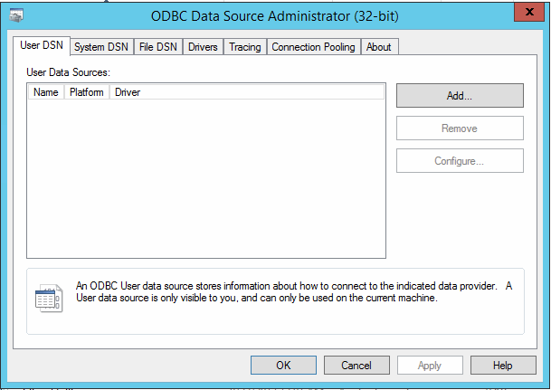
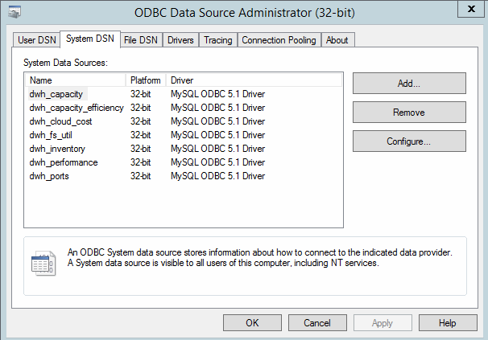

= Modification du mot de passe dwh à l'aide de l'outil d'administration ODBC
:allow-uri-read: 
:icons: font
:imagesdir: ../media/

[role="lead"]
Lorsque vous modifiez le mot de passe sur pour l'utilisateur dwh sur le serveur Insight, le mot de passe doit également être modifié sur le serveur Data Warehouse. Vous utilisez l'outil Administrateur de source de données ODBC pour modifier le mot de passe de l'entrepôt de données.

== Avant de commencer

Vous devez ouvrir une session à distance sur le serveur Data Warehouse à l'aide d'un compte disposant de privilèges d'administrateur.

== Étapes

. Effectuez une connexion à distance au serveur hébergeant cet entrepôt de données.
. Accédez à l'outil d'administration ODBC à l'adresse `C:\Windows\SysWOW64\odbcad32.exe`
+
Le système affiche l'écran Administrateur de source de données ODBC.

+

. Cliquez sur *DSN système*
+
Les sources de données système s'affichent.

+

. Sélectionnez une source de données OnCommand Insight dans la liste.
. Cliquez sur *configurer*
+
L'écran Configuration de la source de données s'affiche.

+
image::../media/data-source-password.gif[mot de passe de la source de données]

. Entrez le nouveau mot de passe dans le champ *Mot de passe*.

