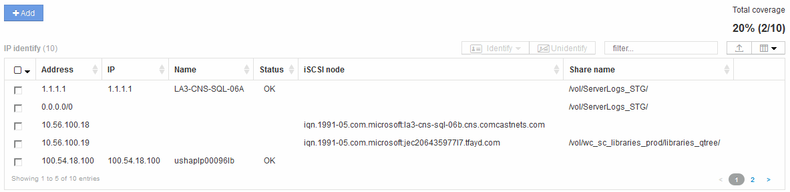

= Résolution du périphérique IP
:allow-uri-read: 
:icons: font
:imagesdir: ../media/

[role="lead"]
L'écran IP Identify affiche tous les partages iSCSI et CIFS ou NFS identifiés par la résolution automatique du périphérique ou par la résolution manuelle des périphériques. Les périphériques non identifiés sont également affichés. L'écran comprend l'adresse IP, le nom, l'état, le nœud iSCSI et le nom de partage des périphériques. Le pourcentage de périphériques qui ont été identifiés avec succès est également affiché.

