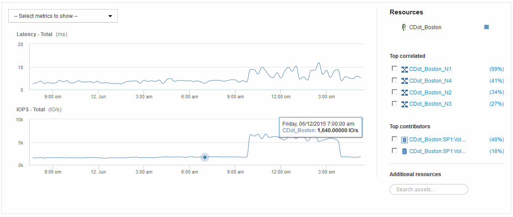

= Vue experte
:allow-uri-read: 
:icons: font
:imagesdir: ../media/

[role="lead"]
La section vue experte d'une page de ressources vous permet de visualiser un exemple de performances pour l'actif de base en fonction d'un nombre quelconque de mesures applicables dans le contexte d'une période donnée (3 heures, 24 heures, 3 jours, 7 jours, ou une période personnalisée) dans le tableau de performances et les ressources qui y sont associées.

Voici un exemple de la section vue experte d'une page d'actifs de volume :

Vous pouvez sélectionner les mesures que vous souhaitez afficher dans le tableau de performances pour la période sélectionnée.

La section Ressources affiche le nom de l'actif de base et la couleur représentant l'actif de base dans le graphique de performances. Si la section corrélée supérieure ne contient pas d'actif que vous souhaitez afficher dans le tableau de performances, vous pouvez utiliser la case *Rechercher des actifs* de la section Ressources supplémentaires pour localiser l'actif et l'ajouter au tableau de performances. Au fur et à mesure que vous ajoutez des ressources, elles apparaissent dans la section autres ressources.

Également dans la section Ressources, le cas échéant, sont les ressources liées à la ressource de base dans les catégories suivantes :

* Meilleure corrélation
+
Indique les ressources dont la corrélation est élevée (pourcentage) avec un ou plusieurs metrics de performance à l'ressource de base.

* Principaux contributeurs
+
Affiche les actifs qui contribuent (pourcentage) à l'actif de base.

* Avide
+
Affiche les ressources qui éloignent les ressources système du contenu en partageant les mêmes ressources, comme les hôtes, les réseaux et le stockage.

* Dégradé
+
Affiche les ressources qui sont épuisées des ressources système dues à cette ressource.

