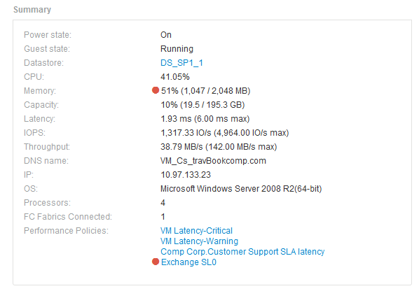

= Récapitulatif
:allow-uri-read: 
:icons: font
:imagesdir: ../media/

[role="lead"]
La section Résumé d'une page de ressource affiche un résumé des informations sur la ressource en question et indique les problèmes liés à la ressource, indiqués par un cercle rouge, avec des liens hypertexte vers des informations supplémentaires sur les ressources associées et vers les politiques de performance affectées à la ressource.

L'exemple suivant montre certains des types d'informations disponibles dans la section Résumé d'une page d'inventaire pour une machine virtuelle. Tout élément avec un cercle rouge fixe à côté indique des problèmes potentiels avec l'environnement surveillé.

