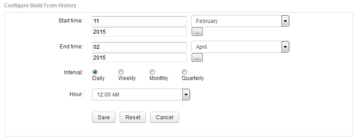

= Ajout d'un travail qui crée une base de données Data Warehouse à partir de l'historique
:allow-uri-read: 
:icons: font
:imagesdir: ../media/

[role="lead"]
Vous pouvez créer la base de données de l'entrepôt de données à l'aide des données historiques conservées sur votre serveur OnCommand Insight, ce qui vous permet d'exécuter des rapports de projection.

== Avant de commencer

Vous devez avoir mis à jour les annotations dans le serveur OnCommand Insight et forcer une mise à jour des informations d'annotation pour l'entrepôt de données.

== Étapes

. Connectez-vous au portail Data Warehouse à l'adresse `+https://hostname/dwh+`, où `hostname` Est le nom du système sur lequel l'entrepôt de données OnCommand Insight est installé.
. Dans le volet de navigation de gauche, cliquez sur *construire à partir de l'historique*.
+
image::../media/oci-dwh-admin-buildfromhistory-gif.gif[Construire à partir de l'historique]

. Cliquez sur *configurer*.
+

. Entrez les heures de début et de fin.
+
Pour afficher un calendrier à partir duquel vous pouvez sélectionner ces dates, cliquez sur la flèche vers le bas près du nom du mois.

+
Le format de l'heure dépend des paramètres régionaux du serveur Data Warehouse.

+
Les heures de début et de fin doivent se trouver dans la plage de l'historique contenue dans tous les serveurs OnCommand Insight auxquels l'entrepôt de données est connecté, comme défini dans l'option connecteurs du portail de l'entrepôt de données. Les heures de début et de fin par défaut reflètent la période maximale valide. Le travail de création d'entrepôt de données s'exécute automatiquement au moment que vous spécifiez.

+
[NOTE]
====
La configuration d'un calendrier non réaliste tel que « quotidien pour 4 ans » entraîne 1460 cycles de construction, qui peuvent prendre 10 jours.

====
. Choisissez l'intervalle.
+
Si vous sélectionnez un intervalle mensuel ou hebdomadaire, le champ jour s'affiche. Si vous avez sélectionné mensuel, jour est une date. Si vous avez sélectionné hebdomadaire, le jour est du dimanche au samedi.

. Choisissez l'heure à laquelle la construction aura lieu.
. Si vous le souhaitez, cliquez sur *Réinitialiser* pour rétablir les paramètres par défaut des options.
. Cliquez sur *Enregistrer*.
. À partir de la page *construire à partir de l'historique*, pour effectuer une construction en dehors de la génération automatique d'horaires, cliquez sur *Exécuter*.
+
La colonne heure cible affiche l'heure à laquelle cette entrée a été créée. La colonne État indique si la construction a été terminée ou a échoué.

