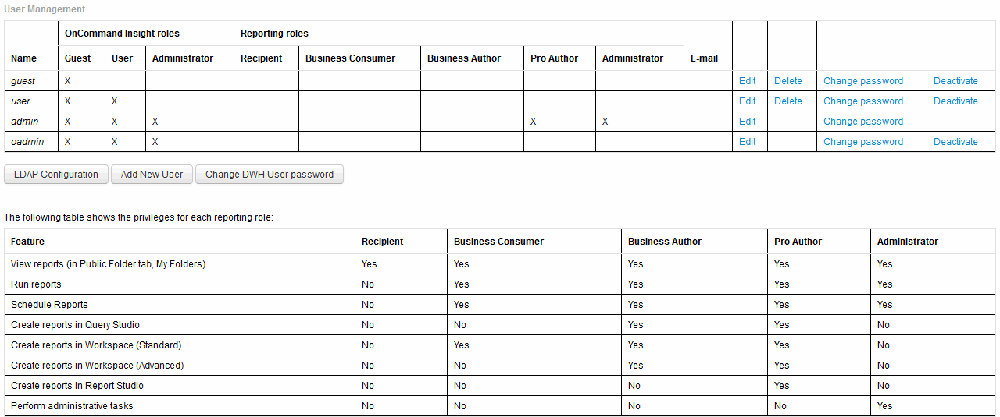

= Gestion des comptes utilisateur
:allow-uri-read: 
:icons: font
:imagesdir: ../media/

[role="lead"]
Vous pouvez configurer les comptes utilisateur, l'authentification des utilisateurs et l'autorisation des utilisateurs à partir du portail Data Warehouse. Un rôle est attribué à chaque compte utilisateur avec l'un des niveaux d'autorisation suivants. Le nombre d'utilisateurs est limité par le nombre de licences Reporting associées à chaque rôle.

== Étapes

. Connectez-vous au portail Data Warehouse à l'adresse `+https://hostname/dwh+`, où `hostname` Est le nom du système sur lequel l'entrepôt de données OnCommand Insight est installé.
. Dans le volet de navigation de gauche, cliquez sur *gestion des utilisateurs*.
+

. Effectuez l'une des opérations suivantes :
+
** Pour modifier un utilisateur existant, sélectionnez la ligne de l'utilisateur et cliquez sur *Modifier*.
** Pour modifier le mot de passe d'un utilisateur, sélectionnez la ligne correspondante et cliquez sur *Modifier le mot de passe*.
** Pour supprimer un utilisateur, sélectionnez la ligne correspondante et cliquez sur *Supprimer*

. Pour activer ou désactiver un utilisateur, sélectionnez la ligne correspondante et cliquez sur *Activer* ou *Désactiver*.

