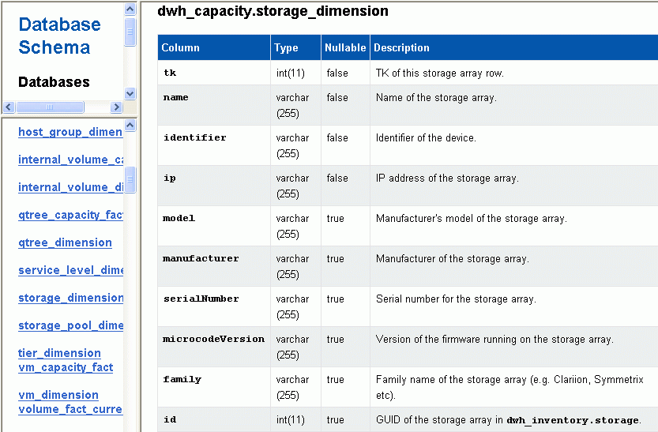

= Affichage des modifications d'annotation dans le schéma de base de données
:allow-uri-read: 
:icons: font
:imagesdir: ../media/

[role="lead"]
Le schéma de base de données reflète les modifications apportées à la table spécifique.

== Description de la tâche

Par exemple, si vous ajoutez des annotations à une matrice de stockage, elles apparaissent dans la table de stockage ou de commutation de l'inventaire ou d'autres magasins de données.

Si vous mettez à jour les annotations sur les ressources à l'aide de l'interface utilisateur de OnCommand Insight et que vous lancez ou attendez la prochaine construction de Data Warehouse, une nouvelle colonne s'affiche ajoutée ou supprimée dans l'objet correspondant dans Inventory (dwh_Inventory) et dans la table de dimensions correspondante (dans le magasin de données approprié). Les résultats sont présentés dans les tableaux suivants :

* dwh_inventory.valeur_annotation
* dwh_inventory.object_to_annotation

== Étapes

. Cliquez sur image:../media/oci-7-help-icon-gif.gif[""] Dans la barre d'outils Data Warehouse et sélectionnez *Documentation*.
. Sélectionnez *Schéma de base de données*.
. Dans le volet *Database Schema* de gauche, faites défiler jusqu'à la section *DWH_INVENTORY* et cliquez sur *switch*.
+
image::../media/oci-dwh-databaseschema-inventory-switch-gif.gif[DWH Table de commutation de schéma de base de données Inventory]

. La table *dwh_Inventory.switch* reflète les modifications :
+

+
La colonne des annotations du centre de données apparaît dans le tableau Storage_dimensions.

