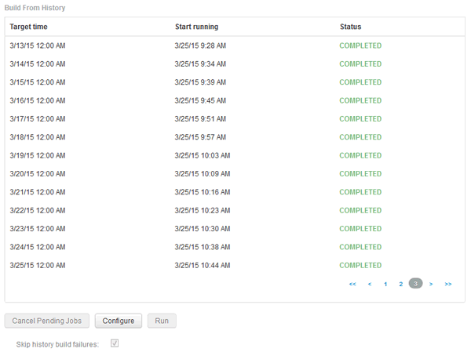

= Ignorer les builds échoués
:allow-uri-read: 
:icons: font
:imagesdir: ../media/

[role="lead"]
Après votre première construction, il se peut que vous rencontriez parfois une construction infructueuse. Pour vous assurer que tous les travaux après un échec de construction sont terminés, vous pouvez activer l'option *Ignorer les échecs de construction de l'historique*.

== Description de la tâche

Si une construction échoue et que l'option *Ignorer les échecs de construction de l'historique* est activée, Data Warehouse continue la construction et ignore les builds défaillants. Si cela se produit, il n'y aura pas de point de données dans les données historiques pour les builds ignorés.

Utilisez cette option uniquement si la construction a échoué.

Si une construction échoue dans la génération à partir de l'historique et que la case *Ignorer les échecs de construction de l'historique* n'est pas cochée, tous les travaux suivants sont interrompus.

== Étapes

. Connectez-vous au portail Data Warehouse à l'adresse `+https://hostname/dwh+`, où `hostname` Est le nom du système sur lequel l'entrepôt de données OnCommand Insight est installé.
. Dans le volet de navigation de gauche, cliquez sur *construire à partir de l'historique*.
+

. Cliquez sur *configurer*.
. Configurez le build.
. Cliquez sur *Enregistrer*.
. Pour ignorer les builds ayant échoué, cochez *Ignorer les échecs de construction de l'historique*.
+
Cette case n'apparaît que si le bouton *Exécuter* est activé.

. Pour effectuer une compilation en dehors de la construction programmée automatique, cliquez sur *Exécuter*.

