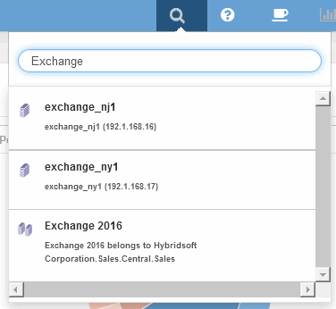
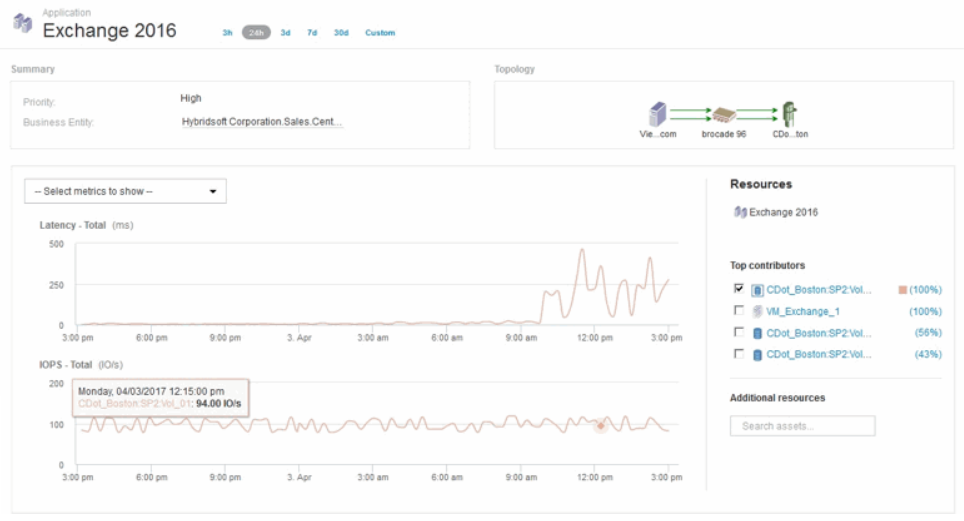

= Analyse d'un problème de performances d'application
:allow-uri-read: 
:icons: font
:imagesdir: ../media/

[role="lead"]
Ce document décrit les étapes à suivre pour gérer les rapports sur les problèmes de performance d'une application ayant un impact sur les utilisateurs ou les administrateurs. Par exemple, les utilisateurs se plaignent que leur application Exchange connaît des périodes de lenteur tout au long de la journée.

== Description de la tâche

Dans OnCommand Insight, une application est une entité configurée. Vous attribuez un nom à l'application et une entité business, puis vous attribuez des ressources de calcul et de stockage à l'application. Cela permet une meilleure vision de bout en bout de l'état de l'infrastructure et une gestion plus proactive de la gestion des actifs de l'infrastructure.

== Étapes

. Pour commencer à examiner le problème, utilisez la barre d'outils Insight pour effectuer une recherche globale de l'application Exchange.
+

+
[TIP]
====
Lorsque vous effectuez une recherche, vous pouvez ajouter un descripteur d'objet avant le nom de l'objet pour affiner les résultats de la recherche.

====
. Lorsque vous sélectionnez « Exchange 2016 » dans les résultats de la recherche, le système affiche la page d'accueil de l'application.
+

+
Sur la page d'accueil de l'application, les informations suivantes vous intéressent :

+
** L'augmentation de la latence s'affiche à droite du graphique de latence sur la période de 24 heures sélectionnée.
** En cas d'augmentation de la latence, il n'y a pas de variation significative du niveau d'IOPS. Il semble que l'augmentation de la latence ne soit pas causée par une utilisation plus importante des applications. Nous ne constatons pas vraiment une demande élevée en IOPS sur le stockage, qui pourrait prendre en compte le pic de latence. L'augmentation de la latence peut être due à un facteur externe.
** À droite des graphiques de la section meilleurs contributeurs, cliquez sur le 100 % du volume interne sélectionné (cdot_Boston:SP2:vol_01). Le système indique que cette ressource contribue à hauteur de 100 % à l'application Exchange 2016. image:../media/top-contributor.gif[""]
** Cliquez sur le lien de navigation de ce volume interne (cdot_Boston:SP2:vol_01) pour accéder à la page d'accueil du volume interne. L'analyse du volume interne peut fournir des informations relatives au pic de latence.

