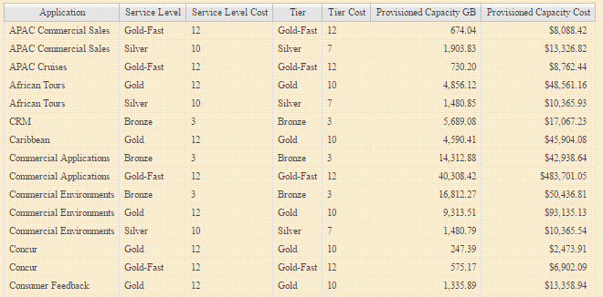

= Création d'un rapport de refacturation simple
:allow-uri-read: 
:icons: font
:imagesdir: ../media/

[role="lead"]
Les rapports de refacturation permettent aux administrateurs et aux responsables d'évaluer l'utilisation de la capacité par application, entité commerciale, niveau de service et niveau. Les rapports de refacturation incluent la responsabilisation en matière de capacité, l'historique de responsabilisation en matière de capacité et les données de tendances. Les données de ces rapports sont créées et planifiées à partir de l'entrepôt de données OnCommand Insight.

== Avant de commencer

Pour créer l'exemple de rapport, votre système doit être configuré de manière à générer des rapports sur les coûts des niveaux de stockage. Les tâches suivantes doivent être effectuées :

* Définir des annotations pour les niveaux.
* Affecter des coûts aux annotations.
* Définissez les applications pour lesquelles vous souhaitez suivre les données.
* Attribuez des applications aux ressources.

== Description de la tâche

Cet exemple utilise l'outil de génération de rapports Cognos Workspace Advanced pour créer le rapport Chargeback. Avec Workspace Advanced, vous créez des rapports en faisant glisser et en déposant des éléments de données dans une palette de rapports.

== Étapes

. Dans l'interface utilisateur Web de OnCommand Insight, cliquez sur l'icône de génération de rapports.
. Connectez-vous au portail de rapports.
. Dans la barre d'outils IBM Cognos Connection, cliquez sur *Launch* > *Cognos Worksapce Advanced*
+
L'écran Workspace Advanced Package s'ouvre.

. Cliquez sur *Packages* > *Chargeback*
+
L'écran IBM Workspace Advanace s'affiche.

. Cliquez sur *Nouveau*
. Dans la boîte de dialogue *Nouveau* rapport, cliquez sur *liste* pour spécifier un rapport de liste.
+
La palette de rapports s'affiche et les Chargeback "`Simple data Mart`" et "Advanced Data Mart" s'affichent sous l'en-tête Source.

. Cliquez sur les flèches en regard de chaque magasin de données pour les développer.
+
Le contenu complet des magasins de données s'affiche.

. Faites glisser « application » du « `Smart Data Mart ` » dans la colonne à l'extrême gauche de la palette de rapports.
+
Lorsque vous faites glisser un objet dans la palette, la colonne se réduit et est mise en surbrillance. Si vous déposez les données de l'application dans les colonnes en surbrillance, toutes les applications sont correctement répertoriées dans la colonne.

. Faites glisser « Tier » du « `Simple Data Mart ` » dans la colonne suivante de la palette de rapports.
+
Le niveau de stockage associé à chaque application est ajouté à la palette.

. Faites glisser « Tier Cost » du « Simple Data Mart ` » dans la colonne suivante de la palette de rapports.
. Faites glisser « capacité provisionnée » du « `Smart Data Mart ` » dans la colonne suivante de la palette de rapports.
. Maintenez la touche *Ctrl* enfoncée et sélectionnez les colonnes « Tier Cost » et « Provisioning Capacity » dans la palette.
. Cliquez avec le bouton droit de la souris dans l'une des colonnes sélectionnées.
. Cliquez sur *calculer* > *coût de niveau * capacité provisionnée DB*
+
Une nouvelle colonne est ajoutée à la palette avec le titre « coût de niveau * capacité de provision GB ».

. Cliquez avec le bouton droit de la souris sur la colonne *Tier Cost * Provision Capacity GB*.
. Cliquez sur *style* > *Type de données*
. Cliquez sur *Type de format* > *devise*
. Cliquez sur *OK*
+
Les données de la colonne sont désormais formatées en devise américaine.

. Cliquez avec le bouton droit de la souris sur « Tier Cost * Provision Capacity GB » et sélectionnez *Edit Data Item Label*
. Remplacez le champ Nom par « coût de la capacité provisionnée ».
. Pour exécuter le rapport, cliquez sur *Exécuter* > *Exécuter le rapport - HTML*
+
Un rapport similaire à ce qui suit s'affiche. 

