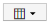

= Variables du tableau de bord
:allow-uri-read: 
:icons: font
:imagesdir: ../media/

[role="lead"]
Les variables du tableau de bord vous permettent de filtrer les données sur plusieurs widgets d'un tableau de bord rapidement et facilement.

== Avant de commencer

Dans cet exemple, l'annotation *City* (également appelée attribut ville) doit être définie sur plusieurs actifs de stockage.

Pour de meilleurs résultats, définissez différentes villes sur différents stockages.

== Description de la tâche

Les variables fournissent un moyen simple et rapide de filtrer les données affichées dans certains ou tous les widgets sur un tableau de bord personnalisé. Les étapes suivantes vous guideront dans la création de widgets utilisant des variables et vous indiqueront comment les utiliser sur votre tableau de bord.

== Étapes

. Connectez-vous à Insight en tant qu'utilisateur avec des autorisations d'administration
. Cliquez sur *tableaux de bord* > *+Nouveau tableau de bord*.
. Avant d'ajouter des widgets, nous voulons définir les variables que nous utiliserons pour filtrer les données du tableau de bord. Cliquez sur le bouton *variable*.
+
La liste des attributs s'affiche.

. Disons que nous voulons configurer le tableau de bord pour qu'il filtre en fonction de la ville. Sélectionnez l'attribut *ville* dans la liste.
+
Le champ de variable $City est créé et ajouté au tableau de bord.

. Ensuite, nous devons indiquer à nos widgets d'utiliser cette variable. La façon la plus simple d'illustrer ceci est d'ajouter un widget de tableau affichant la colonne ville. Cliquez sur le bouton *widget* et sélectionnez le widget *Table*.
. Tout d'abord, ajoutez le champ ville à la table en le sélectionnant dans le sélecteur de colonne  bouton.
+
Ville est un attribut de type liste, il contient donc une liste de choix définis précédemment. Vous pouvez également choisir des attributs de type texte, booléen ou date.

. Cliquez ensuite sur le bouton *Filtrer par +* et choisissez *ville*.
. Cliquez sur *n'importe quel* pour afficher les choix de filtre possibles pour la ville. Notez que la liste comprend maintenant "`$City'" en haut, en plus de tout choix disponible antérieurement. Sélectionnez "`$City" pour utiliser cette variable de tableau de bord.
+
Le choix "`$City"" n'apparaît ici que s'il a été défini précédemment sur la page principale du tableau de bord. Si la variable n'a pas été définie précédemment, seuls les choix existants pour le filtre seront affichés. Seules les variables applicables au type d'attribut sélectionné seront affichées dans la liste déroulante de ce filtre.

+
image::../media/customdash-variablecitydialog2.gif[clientdash variablecitydialog2]

. *Enregistrer* le widget.
. Sur la page du tableau de bord, cliquez sur *any* en regard de la variable $City et sélectionnez la ou les villes que vous souhaitez voir.
+
Votre widget de tableau est mis à jour pour afficher uniquement les villes que vous avez sélectionnées. Vous pouvez modifier les valeurs de la variable $City à volonté et tous les widgets de votre tableau de bord qui sont configurés pour utiliser la variable $City s'actualiseront automatiquement pour n'afficher que les données des valeurs que vous avez sélectionnées.

. Assurez-vous de *Enregistrer* votre tableau de bord lorsque vous l'avez configuré comme vous le souhaitez.

