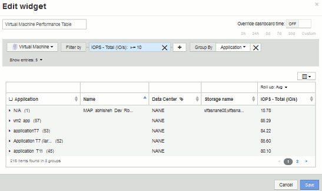

= Tableau de bord personnalisé : performances des machines virtuelles
:allow-uri-read: 
:icons: font
:imagesdir: ../media/

[role="lead"]
Les tableaux de bord et widgets personnalisés de OnCommand Insight vous permettent de bénéficier de vues opérationnelles sur les tendances en matière d'inventaire et de performances.

== Description de la tâche

Les opérations IT sont confrontées à de nombreux défis. Les administrateurs doivent en faire plus avec moins, et une visibilité complète sur vos data centers dynamiques est primordiale. Dans cet exemple, nous allons vous montrer comment créer un tableau de bord personnalisé avec des widgets qui vous fournissent des informations opérationnelles sur les performances des machines virtuelles dans votre environnement. En suivant cet exemple et en créant des widgets pour cibler vos propres besoins, vous pourrez visualiser les performances du stockage back-end par rapport aux performances des machines virtuelles front-end ou afficher la latence des machines virtuelles par rapport aux demandes d'E/S.

Les tableaux de bord personnalisés vous permettent de hiérarchiser les efforts et d'identifier la disponibilité des ressources. Vous pouvez répondre au flux et aux fluctuations des charges de travail, tout en réduisant le temps nécessaire à la détection et à la résolution des problèmes émergents. Les tableaux de bord personnalisés vous permettent de créer des vues hiérarchisées dans l'infrastructure stratégique et ils sont utiles pour identifier la disponibilité des performances dans des technologies multifournisseurs.

Dans cette section, nous allons créer un tableau de bord des performances des ordinateurs virtuels comprenant les éléments suivants :

* Un tableau répertoriant les noms de VM et les données de performances
* Tableau comparant la latence du serveur virtuel à la latence du stockage
* Un graphique illustrant le nombre total d'IOPS en lecture, écriture et lecture pour les machines virtuelles
* Un graphique illustrant le débit maximal pour vos machines virtuelles

Ce n'est qu'un exemple de base. Vous pouvez personnaliser votre tableau de bord afin de mettre en évidence et de comparer les données de performances que vous choisissez de cibler pour vos propres meilleures pratiques opérationnelles.

== Étapes

. Connectez-vous à Insight en tant qu'utilisateur avec des autorisations d'administration.
. Dans le menu *tableaux de bord*, sélectionnez *+Nouveau tableau de bord*.
+
La page Nouveau tableau de bord s'ouvre.

. Donnons un nom significatif à notre tableau de bord. Cliquez sur *Enregistrer*. Dans le champ *Name*, entrez un nom unique pour le tableau de bord, par exemple « VM Performance by application ».
. Cliquez sur *Enregistrer* pour enregistrer le tableau de bord avec le nouveau nom.
. Commençons à ajouter nos widgets. Si nécessaire, faites glisser le commutateur *Edit* sur « on » pour activer le mode Edit.
. Cliquez sur le bouton *widget* et sélectionnez *widget Table* pour ajouter un nouveau widget de tableau au tableau de bord.
+
La boîte de dialogue Modifier le widget s'ouvre. Le nom par défaut est « widget 1 » et les données affichées par défaut sont pour tous les stockages de votre environnement.

+
image::../media/customdash-vm-table-1.gif[customdash vm table 1]

. Nous pouvons personnaliser ce widget. Dans le champ Nom, supprimez « widget 1 » et entrez « Table des performances des machines virtuelles ».
. Cliquez sur le menu déroulant Asset type et remplacez *Storage* par *Virtual machine*.
+
Les données du tableau changent pour afficher toutes les machines virtuelles de votre environnement. Pour l'instant, le tableau affiche uniquement les noms des machines virtuelles. Ajoutons quelques colonnes à la table.

. Cliquez sur *Columns*image:../media/column-picker-button.gif[""] Et sélectionnez _Data Center_, _Storage name_ et _IOPS - Total_. Vous pouvez également essayer de saisir le nom dans la recherche pour afficher rapidement le(s) champ(s) souhaité(s).
+
Ces colonnes sont maintenant affichées dans le tableau. Vous pouvez trier la table en fonction de l'une de ces colonnes. Notez que les colonnes sont affichées dans l'ordre dans lequel elles ont été ajoutées au widget.

. Dans le cadre de cet exercice, nous exclurons les machines virtuelles qui ne sont pas utilisées activement. Analysons tout autre élément avec moins de 10 000 IOPS totales. Cliquez sur le bouton "` + `"en regard de *Filter by* et sélectionnez__IOPS - Total (IO/s)__. Cliquez sur *any* et entrez "`10'" dans le champ *from*. Laissez le champ *à* vide. Cliquez sur le bouton image:../media/check-box-ok.gif[""] pour enregistrer le filtre.
+
Le tableau montre désormais uniquement les machines virtuelles avec au moins 10 IOPS totales.

. Nous pouvons réduire davantage la table en regroupant les résultats. Cliquez sur le bouton "` + `" en regard de *regrouper par* et sélectionnez un champ à regrouper, tel que application ou Cluster. Le regroupement est automatiquement appliqué.
+
Les lignes de la table sont désormais regroupées en fonction de vos paramètres. Vous pouvez développer et réduire les groupes selon vos besoins. Les lignes groupées affichent des données cumulées pour chacune des colonnes. Certaines colonnes vous permettent de choisir la méthode de défilement de cette colonne.

+

. Une fois que vous avez personnalisé le widget de tableau à votre satisfaction, cliquez sur le bouton *Enregistrer*.
+
Le widget de tableau de bord est enregistré dans le tableau de bord.

. Vous pouvez redimensionner le widget du tableau de bord en faisant glisser le coin inférieur droit. Rendez le widget plus large pour afficher clairement toutes les colonnes. Cliquez sur *Enregistrer* pour enregistrer le tableau de bord actuel.
. Nous ajouterons ensuite des graphiques pour afficher les performances de nos machines virtuelles. Créons un graphique linéaire comparant la latence des machines virtuelles et la latence du stockage.
. Si nécessaire, faites glisser le commutateur *Edit* sur « on » pour activer le mode Edit.
. Cliquez sur le bouton *widget* et sélectionnez *graphique linéaire* pour ajouter un nouveau widget de graphique linéaire au tableau de bord.
+
La boîte de dialogue Modifier le widget s'ouvre. Cliquez sur le champ *Name* et nommez ce widget « VM vs Storage Max Latency »

. Sélectionnez *machine virtuelle* et choisissez *latence - Max*. Définissez les filtres que vous souhaitez ou laissez *Filter by* vide. Pour *Roll up*, choisissez «Sum» par «All». Afficher ces données sous forme de diagramme**, et laisser l'axe y sous la forme *principal*.
. Cliquez sur le bouton *+Add* pour ajouter une deuxième ligne de données. Pour cette ligne, sélectionnez *stockage* et *latence - Max*. Définissez les filtres que vous souhaitez ou laissez *Filter by* vide. Pour *Roll up*, choisissez «Sum» par «All». Afficher ces données sous forme de diagramme**, et laisser l'axe y sous la forme *principal*.
+
image::../media/customdash-latencywidgetsettings.gif[paramètres de latencywidgetcustomdash]

. Cliquez sur *Enregistrer* pour ajouter ce widget au tableau de bord.
. Nous allons ensuite ajouter un graphique illustrant le nombre total d'IOPS, lecture, écriture et lecture de VM dans un seul graphique.
. Cliquez sur le bouton *widget* et sélectionnez *graphique de zone* pour ajouter un nouveau widget graphique de zone au tableau de bord.
+
La boîte de dialogue Modifier le widget s'ouvre. Cliquez sur le champ *Name* et nommez ce widget « VM IOPS ».

. Sélectionnez *Virtual machine* et choisissez *IOPS - Total*. Définissez les filtres que vous souhaitez ou laissez *Filter by* vide. Pour *Roll up*, choisissez «Sum» par «All». Affichez ces données sous forme de diagramme** de la zone et laissez l'axe y sous la forme *principal*.
. Cliquez sur le bouton +Ajouter pour ajouter une seconde ligne de données. Pour cette ligne, sélectionnez *Virtual machine* et choisissez *IOPS - Read*. Laissez l'axe y comme *principal*.
. Cliquez sur le bouton +Ajouter pour ajouter une troisième ligne de données. Pour cette ligne, sélectionnez *Virtual machine* et choisissez *IOPS - Write*. Laissez l'axe y comme *principal*.
+
image::../media/custom-dashboard-vm-iops-chart.gif[tableau de bord personnalisé des iops de la machine virtuelle]

. Cliquez sur *Enregistrer* pour ajouter ce widget au tableau de bord.
. Nous allons ensuite ajouter un tableau illustrant le débit des ordinateurs virtuels pour chaque application associée à la machine virtuelle. Nous allons utiliser la fonction d'enroulement pour cela.
. Cliquez sur le bouton *widget* et sélectionnez *graphique linéaire* pour ajouter un nouveau widget de graphique linéaire au tableau de bord.
+
La boîte de dialogue Modifier le widget s'ouvre. Cliquez sur le champ *Name* et nommez ce widget « débit VM par application ».

. Sélectionnez *machine virtuelle* et choisissez *débit - Total*. Définissez les filtres que vous souhaitez ou laissez *Filter by* vide. Pour *Roll up*, choisissez «Max» et sélectionnez par «application» ou «Nom». Afficher les *10 meilleures applications*. Afficher ces données sous forme de diagramme**, et laisser l'axe y sous la forme *principal*.
+
image::../media/customdashboard-vmthroughputsettings.gif[clientdashboard vmdisthrouputsettings]

. Cliquez sur *Enregistrer* pour ajouter ce widget au tableau de bord.
. Vous pouvez déplacer des widgets en maintenant le bouton de la souris enfoncé n'importe où dans le haut du widget et en le faisant glisser vers un nouvel emplacement. Vous pouvez redimensionner les widgets en faisant glisser le coin inférieur droit. Assurez-vous de *Enregistrer* le tableau de bord après avoir effectué vos modifications.
+
À quoi ressemble votre tableau de bord final des performances des VM :

+
image::../media/customdashboard-vm-performance-dashboard.png[tableau de bord personnalisé des performances des machines virtuelles]

