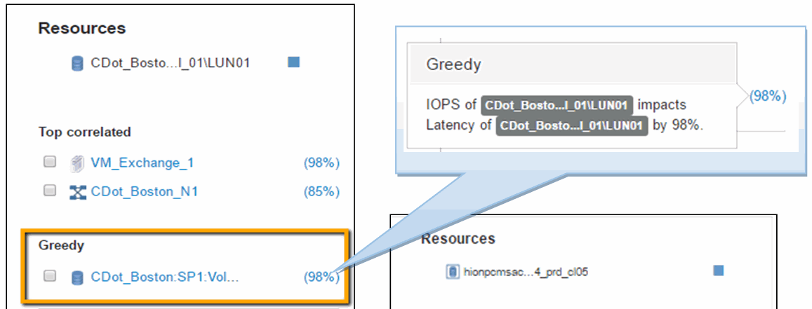

= Examen du volume interne
:allow-uri-read: 
:icons: font
:imagesdir: ../media/

image::../media/greedy-vol1.gif[avidité vol1]

La page d'accueil du volume interne affiche :

* Les graphiques de performances du volume interne correspondent aux résultats obtenus auparavant pour les performances de l'application, à la fois en termes de latence et d'IOPS.
* Dans la section Ressources, où les ressources corrélées sont affichées, une ressource « gourmande » est identifiée (cdot_Boston:SP1:vol_01).

Une ressource gourmande est identifiée par les analyses de corrélation des données. Les ressources gourmandes/dégradées sont des « pairs » qui utilisent la même ressource partagée. La ressource gourmande présente des IOPS ou des taux d'utilisation qui ont un impact négatif sur les IOPS ou la latence de la ressource dégradée.

Les ressources gourmandes et dégradées peuvent être identifiées sur les pages d'accueil des ordinateurs virtuels, des volumes et des volumes internes. Un maximum de deux ressources gourmandes seront affichées sur chaque page d'arrivée.

La sélection du classement de corrélation (%) fournit les résultats de l'analyse de ressources gourmandes. Par exemple, si vous cliquez sur une valeur de pourcentage de consommation, l'opération sur une ressource qui a un impact sur l'opération sur l'actif dégradé est similaire à celle présentée dans l'exemple suivant.

Lorsqu'une ressource dégradée est identifiée, vous pouvez sélectionner le score dégradé (%) pour identifier l'opération et la ressource qui a un impact sur la ressource dégradée.

image::../media/guid-13582cf7-aedf-47d1-935e-edc7c5b1b921.gif[guid 13582cf7 aedf 47d1 935e edc7c5b1b921]
