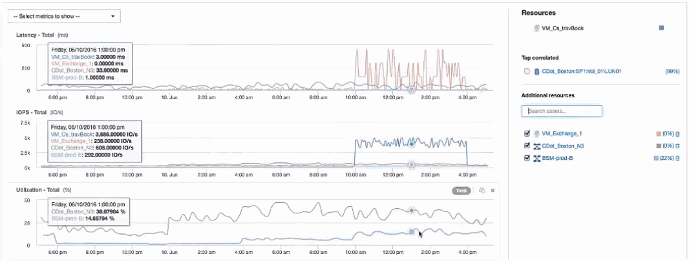

= Examen de la machine virtuelle
:allow-uri-read: 
:icons: font
:imagesdir: ../media/

[role="lead"]
Sur la page d'accueil de la VM, sélectionnez des mesures supplémentaires à afficher et inclure l'utilisation du CPU et de la mémoire. Les graphiques d'utilisation du CPU et de la mémoire indiquent que les deux fonctionnent à près de 100 % de leur capacité. Cela nous indique que le problème avec le serveur Exchange n'est pas un problème de stockage, mais plutôt le résultat d'une utilisation élevée du CPU et de la mémoire de la machine virtuelle et de la permutation conséquente de la mémoire E/S vers le disque.

image::../media/travbook-vm.gif[travbook vm]

Pour résoudre ce problème, vous pouvez rechercher des ressources similaires supplémentaires. Entrez « nœud » dans la boîte de dialogue d'entrée Ressources supplémentaires pour afficher les mesures des ressources similaires à la machine virtuelle Exchange. Cette comparaison permet d'identifier le nœud qui convient le mieux à l'hébergement du workload en cas de modification.

