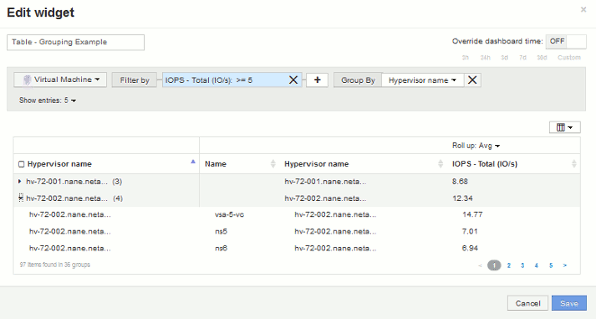

= Exemple de regroupement (avec cumul expliqué)
:allow-uri-read: 
:icons: font
:imagesdir: ../media/

[role="lead"]
Les widgets de tableau vous permettent de regrouper les données pour faciliter leur affichage.

== Description de la tâche

Dans cet exemple, nous allons créer un widget de tableau répertoriant toutes les machines virtuelles regroupées par Data Center.

== Étapes

. Créez ou ouvrez un tableau de bord et ajoutez un widget *Table*.
. Sélectionnez *Virtual machine* comme type de ressource pour ce widget.
. Cliquez sur le sélecteur de colonne image:../media/column-picker-button.gif[""] Et choisissez _Nom de l'hyperviseur_ et _IOPS - Total_.
+
Ces colonnes sont maintenant affichées dans le tableau.

. Ignorez toutes les machines virtuelles sans IOPS et incluez uniquement les machines virtuelles pour lesquelles les IOPS totales sont supérieures à 1. Cliquez sur le bouton *Filtrer par +* et sélectionnez *IOPS - Total*. Cliquez sur *Any*, et dans le champ *from*, tapez 1. Laissez le champ *à* vide. Cliquez sur la case à cocher pour appliquer le filtre.
+
Le tableau indique désormais toutes les machines virtuelles dont le nombre total d'IOPS est supérieur ou égal à 1. Notez qu'il n'y a pas de regroupement dans la table. Toutes les VM sont affichées.

. Cliquez sur le bouton *regrouper par +*.
+
Comme *all* est sélectionné par défaut comme méthode de regroupement, toutes les machines virtuelles sont déplacées dans un seul groupe nommé « all ».

. Au-dessus de la colonne _IOPS - Total_ est maintenant une option *cumul*. La méthode par défaut est _AVG_. Cela signifie que le nombre indiqué pour le groupe correspond à la moyenne de toutes les IOPS totales indiquées pour chaque machine virtuelle du groupe. Vous pouvez choisir de remonter cette colonne de _AVG_, _SUM_, _min_ ou _Max_. Chaque colonne que vous affichez et qui contient des mesures de performances peut être agrégée individuellement.
. Cliquez sur *All* et sélectionnez *Hypervisor name*.
+
La liste des machines virtuelles est désormais groupée par hyperviseur. Vous pouvez développer chaque hyperviseur pour afficher les VM hébergées par celui-ci.

+

. Cliquez sur *Enregistrer* pour enregistrer la table dans le tableau de bord. Vous pouvez redimensionner le widget.
. Cliquez sur *Enregistrer* pour enregistrer le tableau de bord.

