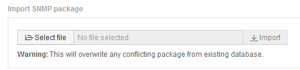

= Importation des packs d'intégration SNMP
:allow-uri-read: 
:icons: font
:imagesdir: ../media/

[role="lead"]
Vous importez les packs d'intégration SNMP dans OnCommand Insight à l'aide de l'interface utilisateur Web. Les packs d'intégration sont identifiés par la valeur « integrationPackName » définie dans le `integration.json` Fichier de configuration contenu dans le fichier ZIP.

== Avant de commencer

Vous devez avoir créé un fichier ZIP correctement formaté contenant le pack d'intégration que vous souhaitez importer sur le serveur OnCommand Insight.

== Description de la tâche

Procédez comme suit pour importer les packs d'intégration SNMP vers le serveur Insight.

== Étapes

. Cliquez sur *Admin* > *Setup* > *intégration SNMP*
+
Le système affiche l'écran Importer le package SNMP : 

. Cliquez sur *Sélectionner le fichier* pour sélectionner le fichier local contenant le paquet SNMP.
+
Le fichier sélectionné s'affiche dans la zone fichier.

+
[NOTE]
====
Tout pack d'intégration existant portant le même nom est écrasé.

====
. Cliquez sur *Importer*
+
Le fichier est importé sur le serveur Insight.

