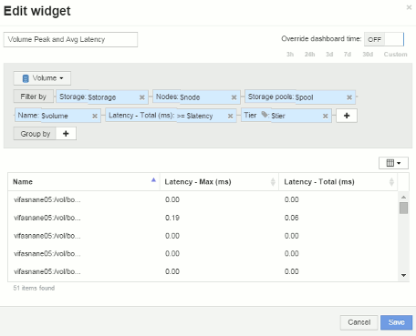
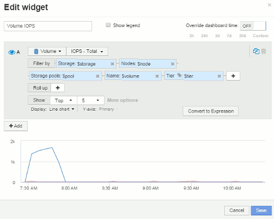

= Exemple de tableau de bord de nœud paramètres de widget
:allow-uri-read: 
:icons: font
:imagesdir: ../media/

[role="lead"]
Exemples de paramètres de widget pour le tableau de bord du nœud :

Voici les paramètres de chacun des widgets de l'exemple de tableau de bord du nœud de stockage.

Utilisation des nœuds :

image:../media/nodeutilchart.gif[""] image:../media/nodeutiltable.gif[""]

Latence du nœud :

image:../media/nodelatencychart.gif[""] image:../media/nodelatencytable.gif[""]

Utilisation du pool de stockage :

image:../media/poolutilchart.gif[""] image:../media/poolutiltable.gif[""]

Débit du pool de stockage :

image:../media/poolthroughputchart.gif[""] image:../media/poolthroughputtable.gif[""]

Latence du volume :

image:../media/vollatencychart.gif[""] 

IOPS du volume :

 image:../media/voliopstable.gif[""]
